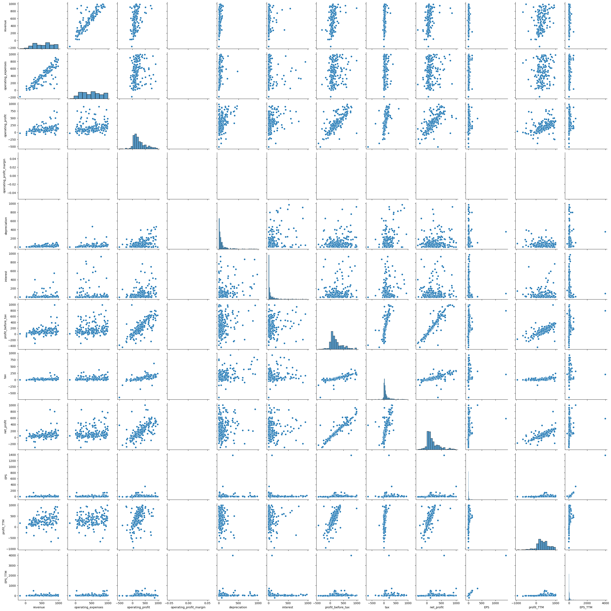

# nifty-500-exploratory-data-analysis

With this university project, my objective was to explore the quarterly performance of companies listed on the National Stock Exchange of India (NSE) by doing a comprehensive exploratory data analysis of the NIFTY 500 dataset. By using data processing and visualization tools, the goal was to find patterns and insights into these organizations’ financial performance. The dataset offers a wealth of data on different financial measures, sectors, and industries. This data serves as the foundation for a thorough analysis of the market environment and performance trends. The National Stock Exchange of India (NSE) maintains the NIFTY 500 index, which includes quarterly results of companies listed in it. The 500 biggest publicly traded firms on the NSE are included in the NIFTY 500, which provides a thorough overview of the Indian market. The data provides insights into the success of these companies by covering a wide range of financial elements, including revenue, expenses, profit, and more. The Nifty 500 index covers stocks from large, mid, and small-cap categories, providing a complete picture of the total market.

## Dataset Description
The dataset was sourced from Kaggle. In this dataset, the stocks that are listed on the NIFTY 500 are in CSV format. The dataset is robust and comprises of wide spectrum of financial measures. Similar types of datasets or complex datasets are available on the NSE (National Stock Exchange) website.

The company name, NSE and BSE codes, sector, industry, and several financial measures are among the 17 columns and more than 500 rows that collectively make up the dataset, namely.

1. Name: The company name
2. NSE Code: The company’s National Stock Exchange code, which is required for NSE trading.
3. BSE Code: The company’s BSE code, which is used to trade on the Bombay Stock Exchange.
4. Sector: The industry that the business operates in. Categorized by sectors under the type of business they conduct.
5. Industry: The industry within which the business works, including more particular details on its area of expertise.
6. Revenue: The total amount of earnings the business made in a given quarter, which reflects its sales or service revenue.
7. Operating Expenses: All costs incurred by the business in the course of regular business activities, excluding expenses for finance and taxes.
8. Operating Profit: The amount of profit left over after operating costs are subtracted from revenue, which shows how profitable the company’s main operations are.
9. Operating Profit Margin: A measure of operational efficiency that expresses as a percentage of revenue converted into operating profit.
10. Depreciation: Depreciation is the allocated cost of physical assets or the gradual decline in the value of the company’s assets over time.
11. Interest: The price that the business pays for borrowing money, which includes interest on loans and other debts.
12. Profit Before Tax: The business’s earnings before income tax is subtracted, which includes both operating and other non-operating revenue and expenses.
13. Tax: The amount of income tax that the business paid during the course of the quarter.
14. Net Profit: Net profit is the amount of money left over after all costs—such as interest, taxes, depreciation, and operational expenses—have been subtracted.
15. Earning Per Share: A measure of profitability per share, EPS is the fraction of a company’s earnings assigned to each outstanding share of common stock.
16. Net Profit TTM: The total net profits over the last twelve months, providing a more comprehensive view of the business’s performance.
17. EPS TTM: This measure gives a longer-term perspective of earnings on a per-share basis by calculating earnings per share over a 12-month period.

## Preprocessing
Before diving into the Exploratory Data Analysis (EDA), preprocessing the dataset is essential to ensuring that it is in an organized and readable state. This entails correcting errors, handling missing values, removing outliers, and performing any necessary modifications. The following are the main actions performed in the preprocessing stage:

* __Handling Missing Values:__ Determine which columns have missing values and in this case, I have dropped the missing/NA values from the data frame. The other way is to select a suitable approach to fill those missing values with relevant data values.
* __Handling Duplicate Values:__ In order to maintain data integrity, we needto ensure that each data is unique and the dataset does not consist of any duplicate values. This also contains data entry errors and some variables need type conversion to fix such issues.
* __Removing Outliers:__ Identifying and handling outliers are crucial for any dataset since the presence of outliers might skew the distribution causing inaccurate statistical processes.
* __Type Conversion:__ Converting relevant attributes to numeric datatype (float64) from object datatype to incorporate visualization and statistical analysis of these attributes.
* __Feature Engineering:__ Deriving new features from the existing raw data using the domain knowledge. Fortunately, the dataset comprises a lot of features so there was no need to derive new features.

## Data Exploration
Once the dataset has been through the pre-processing phase. The primary objective of this phase is to gain a meaningful understanding of the dataset’s attributes, uncover insights, and recognize patterns within the NIFTY 500 dataset.
We start by familiarising ourselves with the dataset, we use _pairplot()_ incorporating the seaborn library which allows us to visualize relationships between each variable within the NIFTY 500 dataset. By using the _pairplot()_ we can summarise a huge amount of data in one glance.

Next would be a heat map visualization (figure 2), which shows the magnitude of a certain phenomenon in the form of colors. It uses colors to exhibit how a value of interest varies based on the data of the other two attributes.

Here, the relationships between operating profit and depreciation, interest and operating profit, net profit and tax, and some other attributes show significant correlation between each other

## Future Improvements

* __Enhanced Feature Engineering:__ To extract desirable features from the ones that already exist, apply sophisticated feature engineering approaches. This could entail developing trend indicators, or financial ratios based on pertinent news items to present a more thorough picture of business performance.
* __Time Series Analysis:__ Perform an extensive time-series analysis to identify patterns and trends in quarterly findings over several years. This could entail using complex time-series models, such as LSTM networks or ARIMA, to find recurring patterns in the dataset and produce more accurate predictions.
* __Predictions from Machine Learning Algorithms:__ Apply machine learning algorithms to predictive analytics tasks, such as forecasting upcoming quarterly performance or spotting possible anomalies.
* __Interactive Data Visualization:__ Create an interactive dashboard that lets users explore and visualize the dataset interactively by utilizing tools such as Dash or Plotly; to make the process easier to use and more educational.
* __More Dataset Integration:__ Considering integrating historical datasets of NIFTY 500 to capture changes and long-term patterns.
* __Sentiment Analysis:__ Include sentiment analysis in social media posts or financial news for each organization. This may offer insightful information about how the market is perceived as well as possible relationships between the general public’s emotions and stock performance.